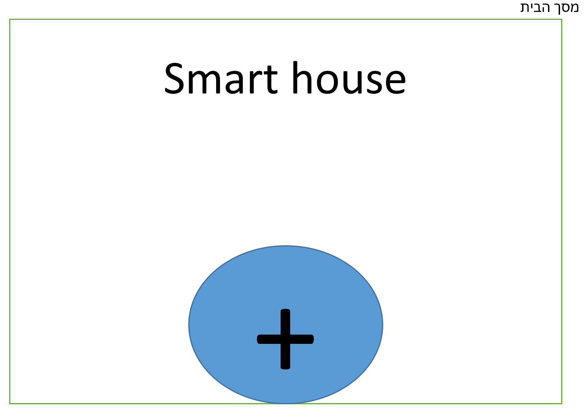
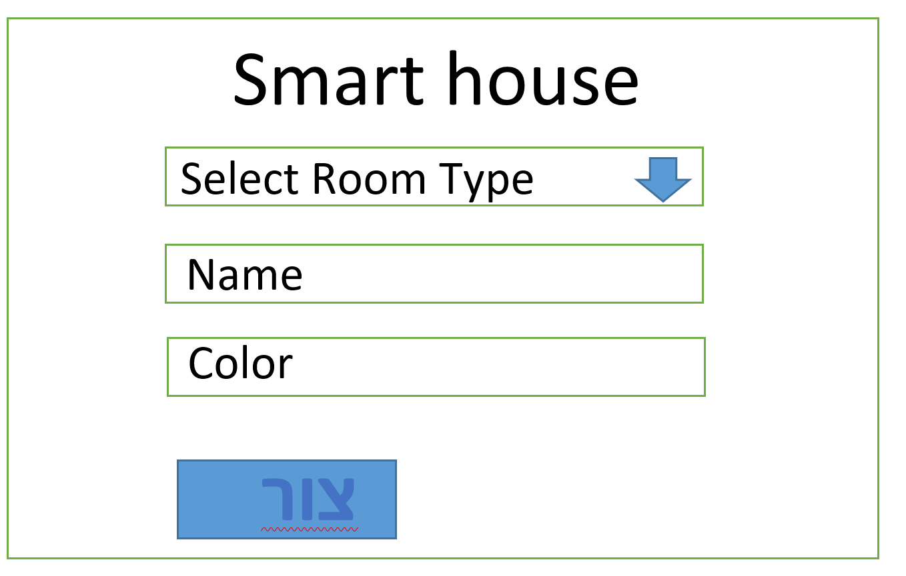
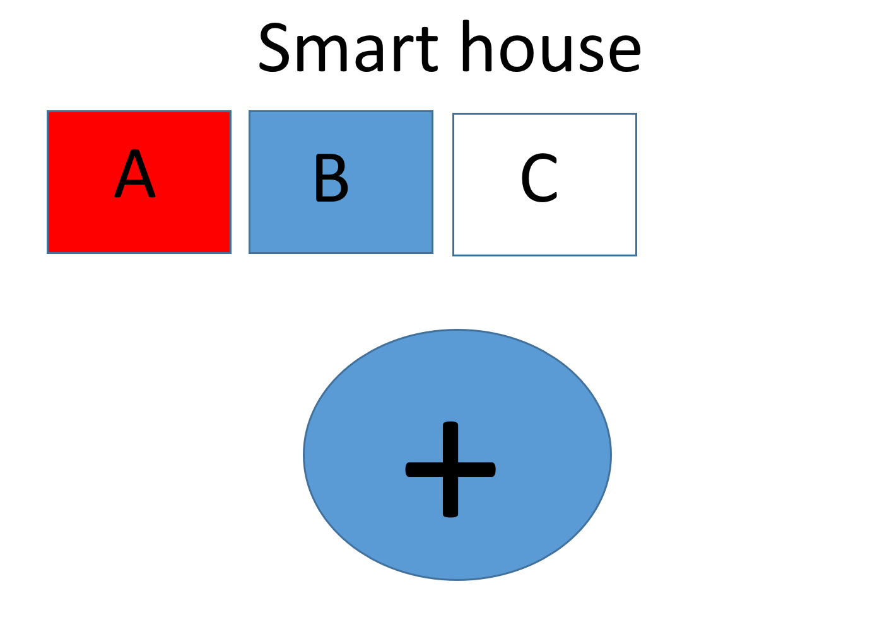
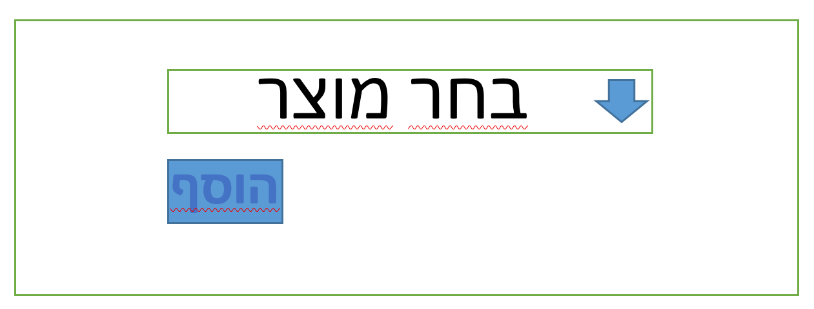
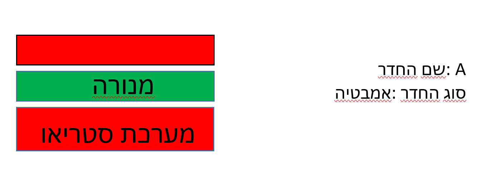

**Smart House**

תרגיל : בניית בית חכם  
מערכת בית חכם הינה אפליקציה אשר מנוהלת ע"י טלפון המשתמש ומאפשרת לו לשלוט במכשירים הקיימים בבית. בנוסף מערכת זו תאפשר למשתמש להוסיף חדרים לבית + להוסיף מכשירים לכל חדר.

יכולות האפליקציה-  
1\. המשתמש יוכל להוסיף חדרים לבית שלו  
סוגי החדרים הינם  
א. חדר שינה,  
ב. חדר אמבטיה / שירותים  
ג. מטבח  
 2\. לכל חדר המשתמש יוכל להוסיף את המכשירים הבאים  
א. מזגן  
ב. מנורה  
ג. מערכת סטריאו  
ד. דוד

מסך הבית

מסך הבית הינו המסך הראשי של האפליקציה.  
מסך זה כולל כותרת smart house וכפתור +.  
לחיצה על כפתור + תאפשר למשתמש להוסיף חדר חדש.  
 

חלון הוספת החדרים יראה באופן הבא  

חלון הוספת חדרים יהיה בערוץ חדש בשם /addroom.  
לעמוד זה יש כותרת קבועה של smart house  
אלמנט select . ו2 שדות טקסט  
אלמנט "בחר חדר חדש" – יהיה מסוג select ויאפשר למשתמש לבחור בין כמה ערכים  
\* חדר שינה , חדר אמבטיה/שירותים , מטבח.  
אלמנט "שם החדר" יהיה אינפוט אשר יוגבל ל9 תווים ויאפשר לתת שם חדש לחדר.  
אלמנט "צבע החדר" יהיה אינפוט אשר יקלוט ערך של צבע.  
 כפתור צור – יבדוק שאכן נבחר חדר ושניתן לפחות תו אחד ב"שם החדר". במידה ולא יופיע alert עם הערך ERROR.  
מיד לאחר הלחיצה המערכת תחזיר את המשתמש לעמוד הראשי גם אם נרשמה שגיאה!  
\*במידה והיית שגיאה המערכת לא תיצור חדר חדש במערכת.

מסך הבית לאחר יצירה של כמה חדרים

בדוגמא זו ניתן לראות את מסך הבית עם 3 ריבועים בצבעים שונים.  
כל ריבוע מציין חדר שנוסף ע"י המשתמש.  
האות בפנים מציינת את שם החדר שניתן לו. וצבע הרקע מתאר את הצבע שניתן לו.  
בעת לחיצה על כל אחד מהריבועים יפתח החלון הבא –

חלון חדר יהיה בערוץ נפרד בשם /room.

\*\*אתגר – חלון חדר יהיה בערוץ בשם שם החדרּ+room

לדוגמה בכניסה לחדר A נעבור לערוץ /roomA

בכניסה לחדר eli נעבור לחדר /roomeli  
בחלון זה תיהיה כותרת קבועה עם הערך smart house  
שם החדר  
סוג החדר  
\* ערכים אלו יקבעו לפי ערכי המשתמש.  
 כפתור "הוסף מוצר" יפתח באותו עמוד אזור נוסף אשר יאפשר הוספה של מוצרים חדשים.  
המשך העמוד יראה כך:

\*אזור זה יהיה באותו עמוד של החדר עצמו ולא יעבור לעמוד חדש!  
אזור זה בנוי מ2 אלמנטים  
1\. אלמנט select אשר מציג את האפשרויות מזגן, דוד, מערכת סטריאו ומנורה.  
2\. כפתור הוסף – לחיצה על כפתור הוסף תעלים את שדה "בחר מוצר" ואת כפתור "הוסף".  
תבדוק איזה מוצר נבחר ותוסיף אותו לאותו חדר  
\* בכל חדר יהיה מקסימום מערכת סטריאו אחת.  
\* דוד יהיה ניתן להוסיף רק בחדר אמבטיה (אין הגבלה לכמות)  
\* בכל חדר יהיו מקסימום 5 מוצרים.  
 במידה ויש בעיה ולא ניתן לייצר את המוצר המערכת תזרוק הודעה שגיאה בalert עם ERROR.  
\*אין צורך לפרט את הבעיה בalert.  
 דוגמא לעמוד "חדר" לאחר הוספת מוצרים

.

בדוגמא זו ניתן לראות את עמוד חדר לאחר הוספה של 3 מוצרים.  
2 מנורות ומערכת סטריאו.  
לחיצה על כל ריבוע של מוצר ישנה את הרקע שלו מאדום לירוק ולהיפך.  
\* מתאר אם המוצר כרגע דולק או מכובה.  
 \*\* יש לשים לב שכניסה לחדר לא תאפס את מצב המוצרים.  
\* כל מוצר כברירת מחדל יהיה מכובה לאחר יצירתו.

בהצלחה 😊
